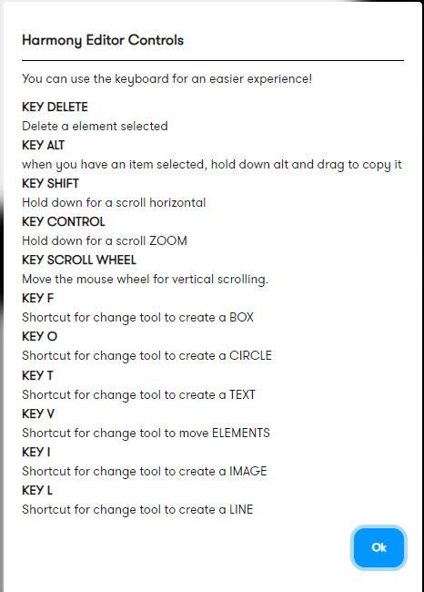
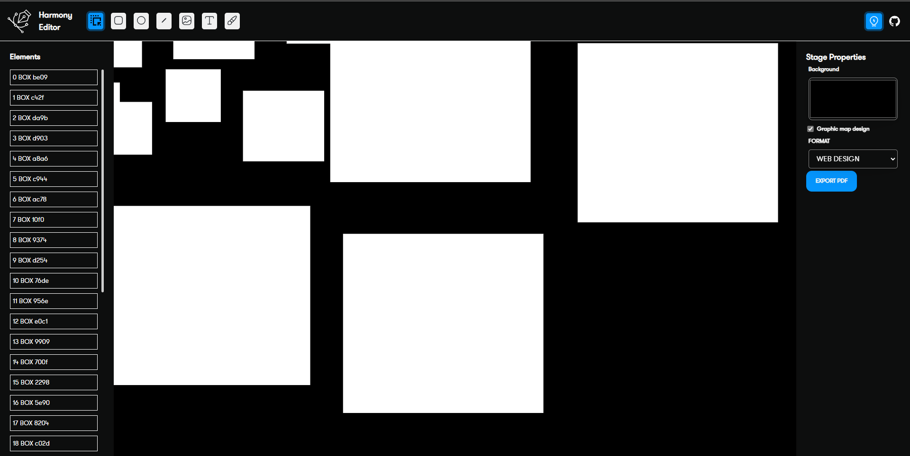

# Harmony Editor

Harmony offers an innovative solution for React projects that require image editing, PDF creation, and dynamic web design capabilities, similar to popular tools like Figma, Adobe XD, and Adobe Photoshop. Harmony is an open-source project specifically designed for React developers, using React Konva and Styled Components as its foundation. Importantly, Harmony is not a paid library or product. It allows each developer to customize it to fit their specific needs at no additional cost.

If you need create elements more quickly. you can use the keyboard shortcuts for improve your experience

The main view with all elements. draw, create web designs or export to pdf.

Select a element and configure their style.

